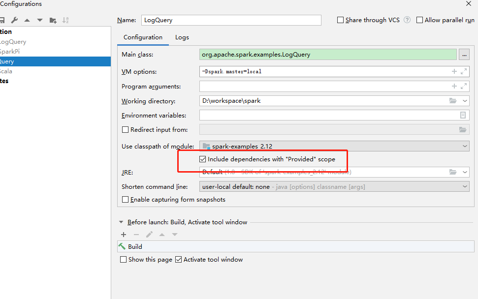
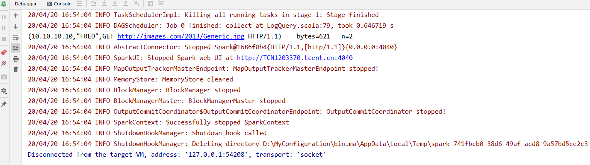

搭建Spark源码本地研读环境
=
系统环境：
-----
           java：java8    
           scala:2.11(后改为2.12.11)  
           maven:3.3.9  
           系统：win10
  
1、forke、clone代码
-----

遇到问题
----
a.clone很慢，会断掉
解决：1）设置缓冲git config --global http.postBuffer 524288000  
      2）使用
      
      1、git  clone --depth=1  https://github.com/mabin001/spark.git
      2、cd spark 
      3、git fetch --unshallow
 
2、编译
----
      mvn  -DskipTests clean package   
遇到问题1：
------------
     编译失败如下，Failed to execute goal org.apache.maven.plugins:maven-enforcer-plugin:3.0.0-M2:enforce (enforce-maven-version) on project spring-data-jpa: Some Enforcer rules have failed. Look above for specific messages explaining why the rule failed. -> [Help 1]
 
原因：maven-enforcer-plugin插件会强制检查本地环境同spark源码环境是否一致，达到开发环境一致性目的。

解决：
-----  
方案一：调整本地环境满足当前的插件约束，比如楼主这里只需要升级本地的maven版本到3.5.0及以上即可解决问题  
方案二：跳过enforcer的强制约束，在构建的命令加上跳过的指令，如：mvn install -Denforcer.skip=true  
方案三：设置规则校验失败不影响构建流程，在构建的命令上加指令，如：mvn install -Denforcer.fail=false

我采用的是忽略，  
如下：mvn  -Denforcer.fail=false -DskipTests clean package  

遇到问题2：  
---------
           import org.apache.spark.sql.catalyst.parser.SqlBaseParser._ 不存在
解决：
------
使用Maven Projects中把Spark Project Catalyst单独执行Generate Sources and Update Folders  

有网友帖子解释了具体原因使用了ANTLR来生成SQLParser导致的，直接在spark-catalyst工程下执行mvn clean compile就可以了,然后需要将生成的target/generated-sources/antlr4目录mark as source

编译成功！
---
测试  
--------
        ./bin/spark-shell

3、导入idea  
--------
4、运行实例代码（LogQuery类）
------
           VM options: -Dspark.master=local（idea中配置）
遇到问题：
----
   
a）classnotfoundexception  
因为spark源码中很多依赖都是provide级别，刚刚开始我入侵源码，修改scope标签，比较笨，很费时间，  
后来发现有个按钮，如下：  

###再次运行，成功！

